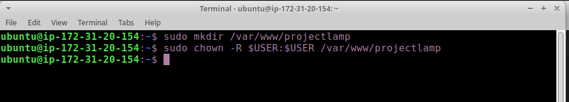
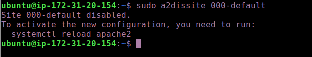

# STEP 4 — CREATING A VIRTUAL HOST FOR YOUR WEBSITE USING APACHE

#### In this project, you will set up a domain called projectlamp, but you can replace this with any domain of your choice.

- Apache on Ubuntu 20.04 has one server block enabled by default that is configured to serve documents from the /var/www/html directory.
We will leave this configuration as is and will add our own directory next next to the default one.

1. Create the directory for projectlamp using ‘mkdir’ command as follows: `sudo mkdir /var/www/projectlamp`


2. Next, assign ownership of the directory with your current system user:
run  `sudo chown -R $USER:$USER /var/www/projectlamp`



3. Then, create and open a new configuration file in Apache’s sites-available directory using your preferred command-line editor. Here, we’ll be using vi or vim (They are the same by the way):


4. From the previous command, This will create a new blank file. Paste in the following bare-bones configuration by hitting on i on the keyboard to enter the insert mode, and paste the text.

```
<VirtualHost *:80>
    ServerName projectlamp
    ServerAlias www.projectlamp 
    ServerAdmin webmaster@localhost
    DocumentRoot /var/www/projectlamp
    ErrorLog ${APACHE_LOG_DIR}/error.log
    CustomLog ${APACHE_LOG_DIR}/access.log combined
</VirtualHost>
```


5. To save and close the file, simply follow the steps below:

- Hit the esc button on the keyboard
- Type :
- Type wq. w for write and q for quit
- Hit ENTER to save the file

6. You can use the ls command to show the new file in the sites-available directory
run `sudo ls /etc/apache2/sites-available`

You will see something like this;


7. You can now use a2ensite command to enable the new virtual host:
`sudo a2ensite projectlamp`


8. You might want to disable the default website that comes installed with Apache. This is required if you’re not using a custom domain name, because in this case Apache’s default configuration would overwrite your virtual host. To disable Apache’s default website use a2dissite command , type:
`sudo a2dissite 000-default`



9. To make sure your configuration file doesn’t contain syntax errors, run:
`sudo apache2ctl configtest`


10. Finally, reload Apache so these changes take effect:
`sudo systemctl reload apache2`


11. Your new website is now active, but the web root /var/www/projectlamp is still empty. Create an index.html file in that location so that we can test that the virtual host works as expected:
`sudo echo 'Hello LAMP from hostname' $(curl -s http://169.254.169.254/latest/meta-data/public-hostname) 'with public IP' $(curl -s http://169.254.169.254/latest/meta-data/public-ipv4) > /var/www/projectlamp/index.html`


12. Now go to your browser and try to open your website URL using IP address:
`http://<Public-IP-Address>:80`


#### Yipee, you have a created a host and you are serving a webpage from the host and it is accesible through the public IP