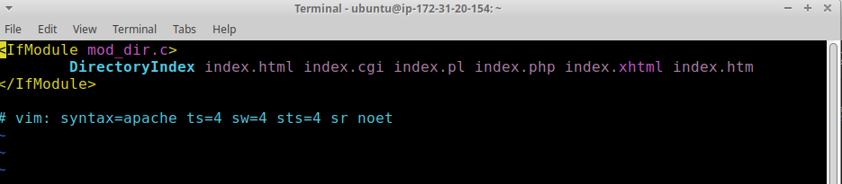
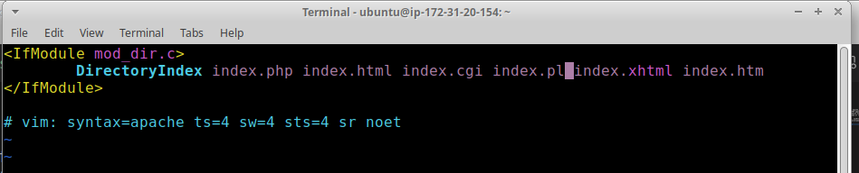
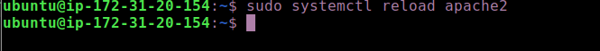
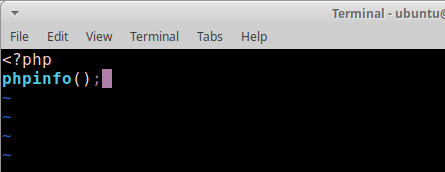
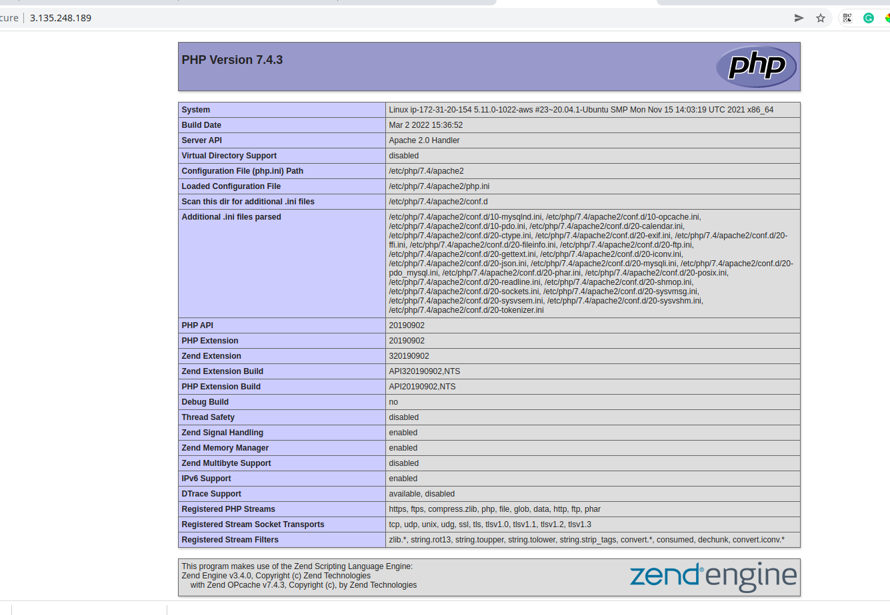
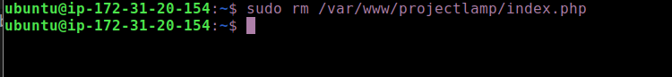

# STEP 5 — ENABLE PHP ON THE WEBSITE

With the default DirectoryIndex settings on Apache, a file named index.html will always take precedence over an index.php file. This is useful for setting up maintenance pages in PHP applications, by creating a temporary index.html file containing an informative message to visitors. Because this page will take precedence over the index.php page, it will then become the landing page for the application. Once maintenance is over, the index.html is renamed or removed from the document root, bringing back the regular application page.

1. In case you want to change this behavior, you’ll need to edit the /etc/apache2/mods-enabled/dir.conf file and change the order in which the index.php file is listed within the DirectoryIndex directive:

`sudo vim /etc/apache2/mods-enabled/dir.conf`

change the configuration from 

`DirectoryIndex index.html index.cgi index.pl index.php index.xhtml index.htm`

to

`DirectoryIndex index.php index.html index.cgi index.pl index.xhtml index.htm`

2. To make the changes come ito effect reload apache2 by running
`sudo systemctl reload apache2`

3. Now that you have a custom location to host your website’s files and folders, we’ll create a PHP test script to confirm that Apache is able to handle and process requests for PHP files.

Create a new file named index.php inside your custom web root folder:
`vim /var/www/projectlamp/index.php`

4. Add the following php code to the editothat opens
<?php
phpinfo();

5. When you are finished, save and close the file, refresh the page and you will see a page similar to this:

### If you can see this page in your browser, then your PHP installation is working as expected

6. After checking the relevant information about your PHP server through that page, it’s best to remove the file you created as it contains sensitive information about your PHP environment -and your Ubuntu server. You can use rm to do so:

`sudo rm /var/www/projectlamp/index.php`

### Congratulations! You have finished your very first REAL LIFE PROJECT by deploying a LAMP stack website in AWS Cloud!

