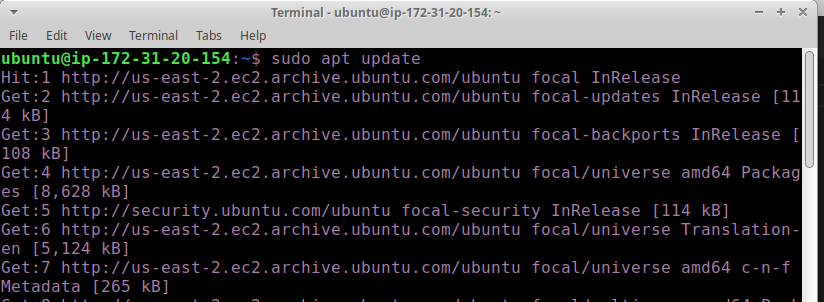
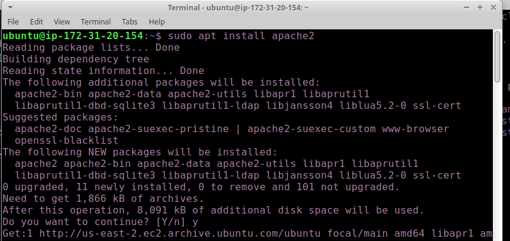
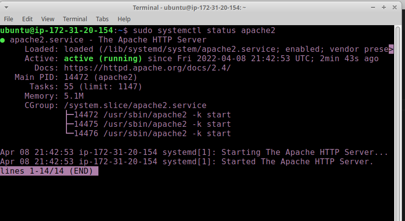
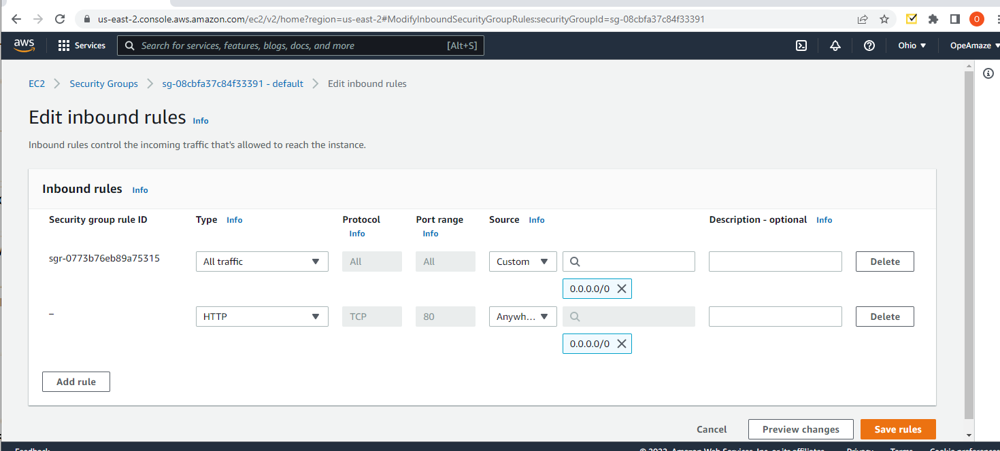
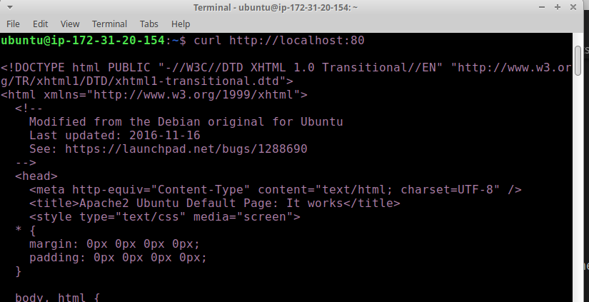
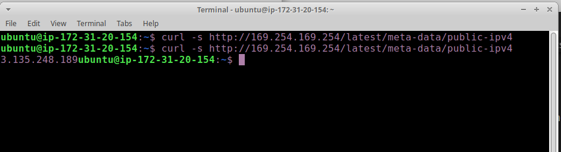
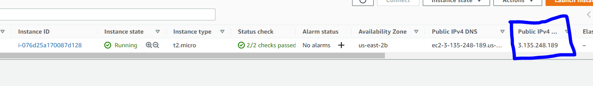
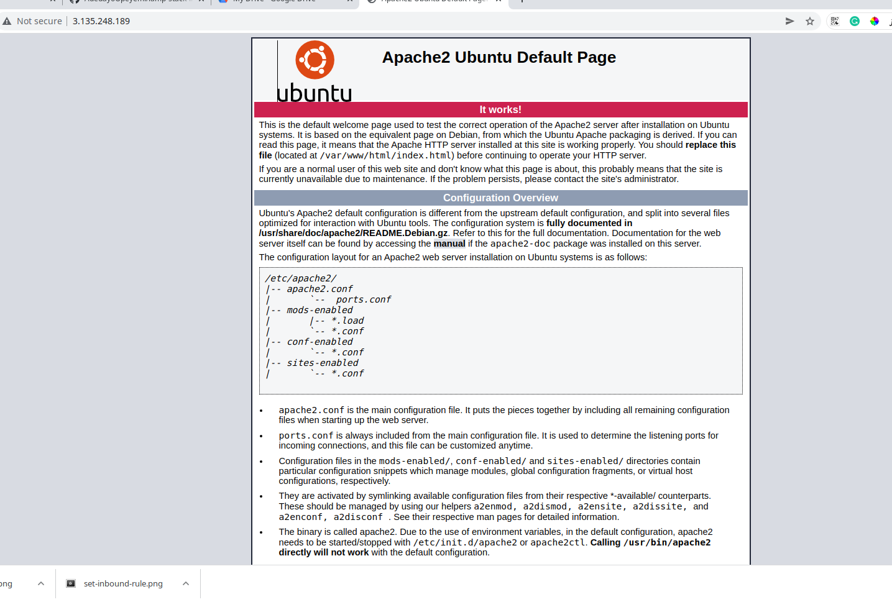

# STEP 1 — INSTALLING APACHE AND UPDATING THE FIREWALL

### Steps

1. Update a list of packages in package manager by running command `sudo apt update`

2. run apache2 package installation command `sudo apt install apache2`

3. to verify that apache2 is running as a service run `sudo systemctl status apache2`
    the active state show 'Active: active (running)'

## Congrats you have launched your Web server in the clouds!

4. In order for our webserver to be able to receive traffic we need to open TCP port 80 on the EC2 Machine running

5. to verify that our webserver is accessible use:
- run `curl http://localhost:80` which is the same as `curl http://127.0.0.1:80`
You should get a response which is actually some text that represents the files needed to load the webpage it returns

6. Let us now check if our server can respond to public requests. You can get the public IP address of your EC2 instance either from the command line as shown below

or by checking your EC2 instance dteails on the AWS console

7. Copy the public IP adddress you got earlier and run put it in your web browser using this format
  `http://<Public-IP-Address>:80`

  if everything has been done correctly you should get the page below as your response.

  
